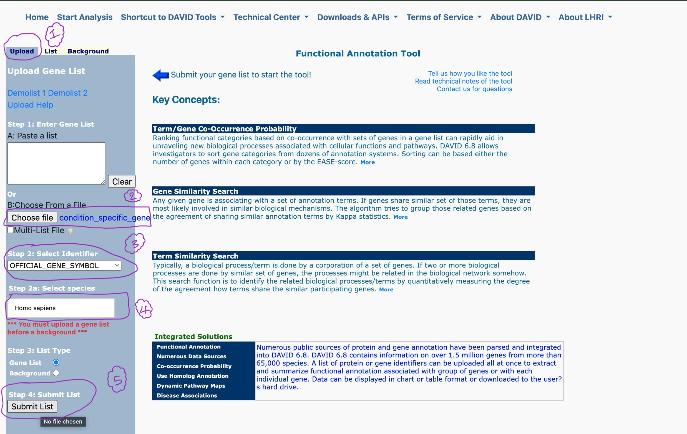
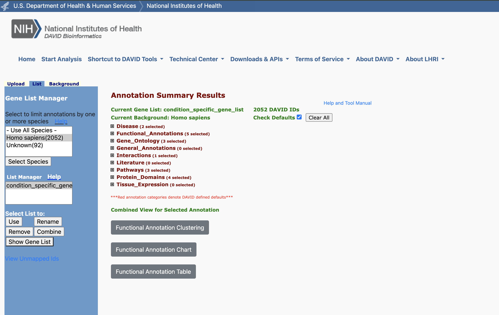

<h2 style="color:#369;"> Enrichment Analysis</h2>

>This directory contains the output of enrichment analysis facilitated by [DAVID](https://david.ncifcrf.gov/summary.jsp).

<h3 style="color:#369;"> Directory Structure</h3>

This directory has the following structure

```Bash

├── README.md
├── disease
│   ├── DISGENET.pdf
│   ├── GAD_DISEASE.pdf
│   ├── GAD_DISEASE_CLASS.pdf
│   ├── UP_KW_DISEASE.pdf
│   ├── chart_066ABBFD13651715023564226.txt
│   ├── chart_066ABBFD13651715023667174.txt
│   ├── chart_066ABBFD13651715023715558.txt
│   └── chart_066ABBFD13651715023792829.txt
├── f_2.png
├── functional_annotations
│   ├── UP_KW_BIOLOGICAL_PROCESS.pdf
│   ├── UP_KW_CELLULAR_COMPONENT.pdf
│   ├── UP_KW_MOLECULAR_FUNCTION.pdf
│   ├── UP_KW_PTM.pdf
│   ├── UP_SEQ_FEATURE.pdf
│   ├── chart_066ABBFD13651715023867762.txt
│   ├── chart_066ABBFD13651715024011605.txt
│   ├── chart_066ABBFD13651715024045321.txt
│   ├── chart_066ABBFD13651715024104250.txt
│   └── chart_066ABBFD13651715024155660.txt
├── gene_ontology
│   ├── GOTERM_BP_1.pdf
│   ├── GOTERM_BP_DIRECT.pdf
│   ├── GOTERM_CC_FAT.pdf
│   ├── chart_066ABBFD13651715024232704.txt
│   ├── chart_066ABBFD13651715024293573.txt
│   └── chart_066ABBFD13651715024356256.txt
├── general_annotations
│   ├── CHROMOSOME.pdf
│   ├── CYTOGENETIC_LOCATION.pdf
│   ├── ENTREZ_GENE_SUMMARY.pdf
│   ├── chart_066ABBFD13651715024424864.txt
│   ├── chart_066ABBFD13651715024466673.txt
│   └── chart_066ABBFD13651715024507953.txt
├── interactions
│   ├── BIOGRID_INTERACTION.pdf
│   ├── DIP.pdf
│   ├── DRUGBANK.pdf
│   ├── HIV_INTERACTION.pdf
│   ├── HIV_INTERACTION_CATEGORY.pdf
│   └── UCSC_TFBS.pdf
├── literature
│   └── HIV_INTERACTION_PUBMED_ID.pdf
├── pathways
│   ├── KEGG_PATHWAY.pdf
│   ├── REACTOME_PATHWAY.pdf
│   └── WIKIPATHWAYS.pdf
├── protein_domains
│   ├── GENE3D.pdf
│   ├── INTERPRO.pdf
│   └── UP_KW_DOMAIN.pdf
└── tissue_expression
    ├── GNF_U133A_QUARTILE.pdf
    └── UP_TISSUE.pdf

```

Each sub-directory contains the enrichment analysis output, as the name suggests.

<h4 style="color:#369;">Reproducibility</h4>
 After performing `Network Comparison` MODA-Wrapper produces list of genes that are conserved anad differntially expressed in two files conserved_gene_list.txt and condition_specific_gene_list.txt respectively.</br> 

 Visit [Functional Enrichment Tool](https://david.ncifcrf.gov/summary.jsp).
  </br>
In the `Upload` tab, upload the gene list <font color="#f0ad4e">condition_specific_gene_list.txt</font> and choose `OFFICIAL_GENE_SYMBOL` in  `Select Identifier` section.</br>
Choose `Homo sapians` as the species name.</br>
Select Gene list and finally submit the gene list as shown below:

 

 <h4 style="color:#369;"> Enrichment Analysis Results</h4>
After a successful upload, [DAVID](https://david.ncifcrf.gov/summary.jsp) analyzes the gene list and generates a detailed enrichment analysis result as shown below:

  

  The different parts of the analysis can be expanded to get insights into overlapping genes from our list to different genetic databases such as `DISGENET`, `GAD Gene-Disease Associations`, `UniProt knowledgebase Disease` etc
  

  Figure below  shows overlap of `condition_specific_gene_list.txt` genes with `DISGENET` database and the list of significantly enriched genes and the associated disease with their p-values:
   </br></br></br>

`GAD Gene-Disease Associations` gene overlap:
</br></br></br>


etc...